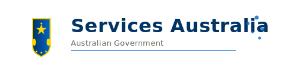

# Services Australia Logo

## Files

- **Services_australia_logo.svg** - Transparent SVG vector logo (recommended)
- **Services_australia_logo.png** - Transparent PNG raster logo (if needed)

## SVG Logo (Recommended)

The SVG logo is the primary logo file and should be used whenever possible because:

✅ **Advantages:**
- Infinitely scalable without quality loss
- Smaller file size
- Transparent background
- Crisp on all displays (including Retina/4K)
- Editable in vector graphics software

### Usage in HTML

```html

```

### Usage in React/JSX

```jsx
import logo from './Services_australia_logo.svg';


```

### Usage in Markdown

```markdown

```

## Converting SVG to PNG (If Needed)

If you need a PNG version for compatibility reasons:

### Method 1: Online Converter
1. Visit [CloudConvert](https://cloudconvert.com/svg-to-png) or [SVG to PNG](https://svgtopng.com/)
2. Upload `Services_australia_logo.svg`
3. Set dimensions (recommended: 800x224 or higher for quality)
4. Download the transparent PNG

### Method 2: Using Inkscape (Free Software)
```bash
# Install Inkscape
# Windows: Download from https://inkscape.org/
# Mac: brew install inkscape
# Linux: sudo apt-get install inkscape

# Convert SVG to PNG
inkscape Services_australia_logo.svg --export-type=png --export-filename=Services_australia_logo.png --export-width=800
```

### Method 3: Using ImageMagick
```bash
# Install ImageMagick
# Windows: Download from https://imagemagick.org/
# Mac: brew install imagemagick
# Linux: sudo apt-get install imagemagick

# Convert SVG to PNG
convert -background none -density 300 Services_australia_logo.svg -resize 800x Services_australia_logo.png
```

### Method 4: Using Node.js (sharp library)
```bash
npm install sharp

# Create convert.js:
const sharp = require('sharp');
sharp('Services_australia_logo.svg')
  .resize(800)
  .png()
  .toFile('Services_australia_logo.png');

# Run:
node convert.js
```

## Logo Specifications

### Colors

| Element | Color | Hex Code |
|---------|-------|----------|
| Primary Blue | Navy Blue | `#003366` |
| Secondary Blue | Royal Blue | `#0066CC` |
| Gold | Australian Gold | `#FFD700` |
| Text Gray | Medium Gray | `#666666` |

### Dimensions

- **SVG Viewbox:** 500 x 140
- **Recommended PNG:** 800 x 224 (maintains aspect ratio)
- **Minimum Size:** 400 x 112 (for web use)
- **Print Quality:** 2000 x 560 (300 DPI)

### Clear Space

Maintain a clear space around the logo equal to the height of the "A" in "Australia" on all sides.

### Minimum Size

- **Digital:** 200px width minimum
- **Print:** 50mm width minimum

## Usage Guidelines

### ✅ DO:
- Use the logo on white or light backgrounds
- Maintain the aspect ratio when resizing
- Ensure sufficient contrast with background
- Use the SVG version when possible

### ❌ DON'T:
- Distort or stretch the logo
- Change the colors
- Add effects (shadows, glows, etc.)
- Place on busy backgrounds
- Rotate the logo

## Accessibility

The SVG logo includes:
- `<title>` element for screen readers
- `<desc>` element for detailed description
- Semantic structure for assistive technologies

When using in HTML, always include an `alt` attribute:
```html

```

## License & Attribution

This logo is a stylized representation created for the Australian Child Support Calculator project. 

**Important:** This is NOT the official Services Australia logo. For official branding:
- Visit [Services Australia](https://www.servicesaustralia.gov.au/)
- Contact Services Australia for official brand guidelines
- Use official logos for official purposes only

## Support

For questions about the logo:
- Open an issue on [GitHub](https://github.com/Verridian-ai/australian-child-support-calculator/issues)
- See the main [README](../../README.md)

---

*Created for the Australian Child Support Calculator project*
*Last Updated: December 2024*

